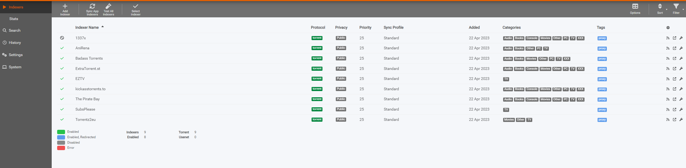
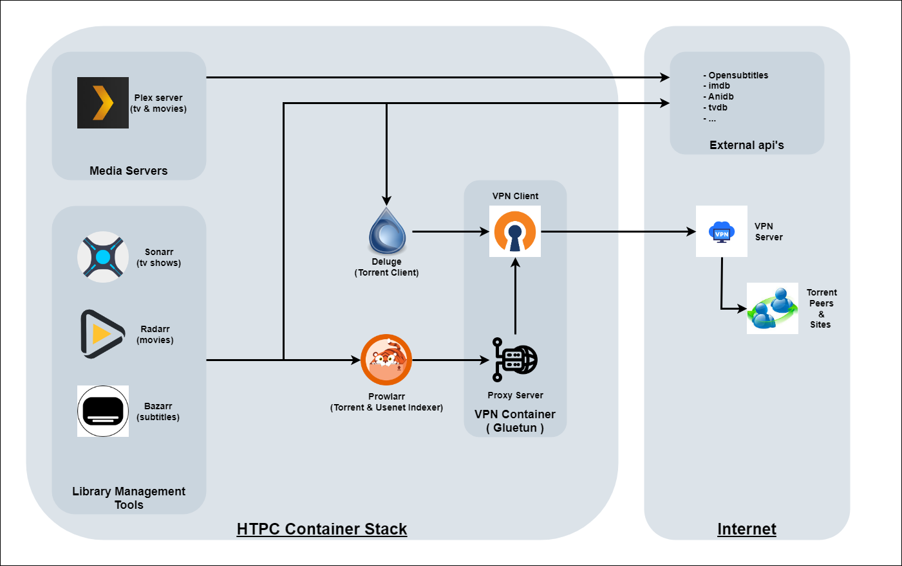
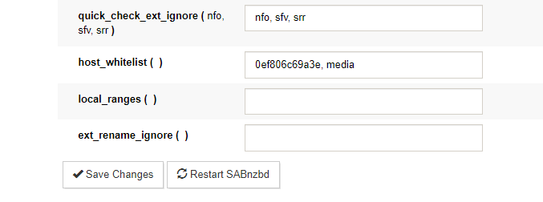
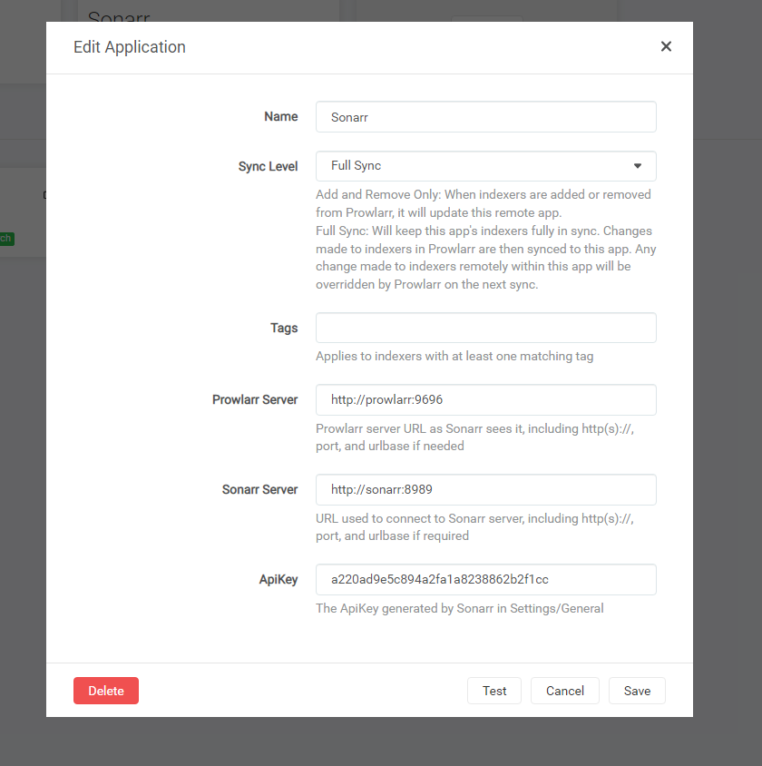
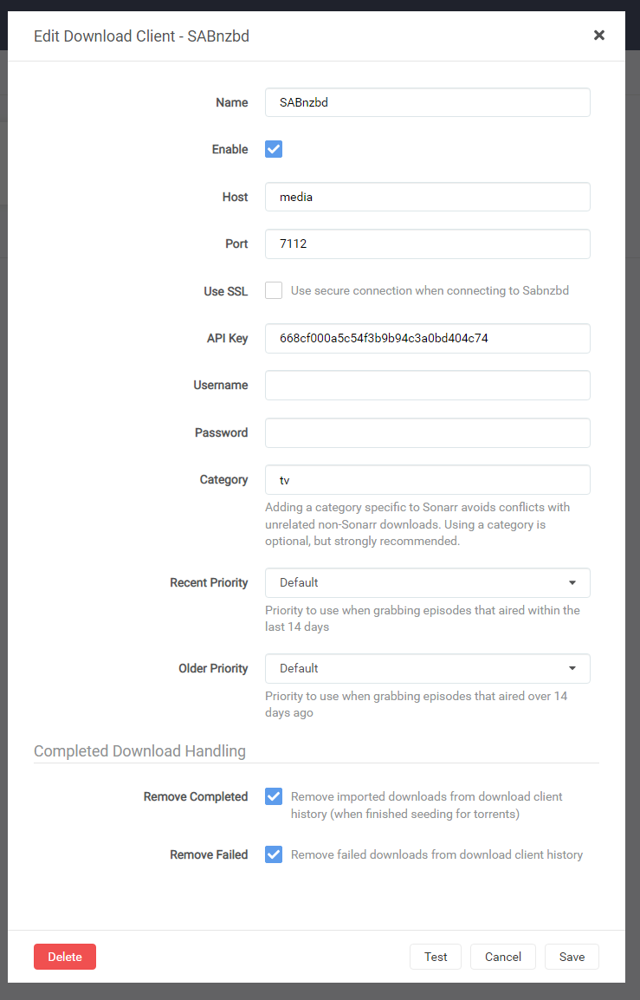

# HTPC Download Box

Sonarr / Radarr / Prowlarr / SABnzbd / Deluge / Gluetun / Plex

TV shows and movies download, sort, with the desired quality and subtitles, behind a VPN (optional), ready to watch, in a beautiful media player.
All automated.

## Table of Contents

- [HTPC Download Box](#htpc-download-box)
  - [Table of Contents](#table-of-contents)
  - [ToDo](#todo)
  - [Overview](#overview)
    - [Monitor TV shows/movies with Sonarr and Radarr](#monitor-tv-showsmovies-with-sonarr-and-radarr)
    - [Search for releases automatically with Usenet and torrent indexers](#search-for-releases-automatically-with-usenet-and-torrent-indexers)
    - [Handle bittorrent and usenet downloads with Deluge and NZBGet](#handle-bittorrent-and-usenet-downloads-with-deluge-and-nzbget)
    - [Organize libraries and play videos with Plex](#organize-libraries-and-play-videos-with-plex)
  - [Hardware configuration](#hardware-configuration)
  - [Software stack](#software-stack)
  - [Installation guide](#installation-guide)
    - [Introduction](#introduction)
    - [Install docker](#install-docker)
    - [Premade docker-compose](#optional-use-premade-docker-compose)
    - [Setup environment variables](#setup-environment-variables)
    - [Create host directory structure](#create-host-directory-structure)
    - [Setup Deluge](#setup-deluge)
      - [Deluge Docker container](#deluge-docker-container)
      - [Deluge Configuration](#deluge-configuration)
    - [Setup a VPN Container](#setup-a-vpn-container)
      - [VPN Introduction](#vpn-introduction)
      - [privateinternetaccess.com custom setup](#privateinternetaccesscom-custom-setup)
      - [VPN Docker container](#vpn-docker-container)
    - [Setup SABnzbd](#setup-sabnzbd)
      - [Usenet Introduction](#usenet-introduction)
      - [SABnzbd Docker container](#sabnzbd-docker-container)
      - [SABnzbd Configuration](#sabnzbd-configuration)
    - [Setup Plex](#setup-plex)
      - [Media Server Docker Container](#media-server-docker-container)
      - [Configuration](#plex-configuration)
      - [Setup Plex clients](#setup-plex-clients)
    - [Setup Prowlarr](#setup-prowlarr)
      - [Prowlarr Docker container](#prowlarr-docker-container)
      - [Prowlarr Configuration](#prowlarr-configuration)
    - [Setup Sonarr](#setup-sonarr)
      - [Sonarr Docker container](#sonarr-docker-container)
      - [Sonarr Configuration](#sonarr-configuration)
      - [Give Sonarr a try](#give-sonarr-a-try)
    - [Setup Radarr](#setup-radarr)
      - [Radarr Docker container](#radarr-docker-container)
      - [Radarr Configuration](#radarr-configuration)
      - [Give Radarr a try](#give-radarr-a-try)
      - [Movie discovering](#movie-discovering)
    - [Setup Bazarr](#setup-bazarr)
      - [Bazarr Docker container](#bazarr-docker-container)
      - [Bazarr Configuration](#bazarr-configuration)
  - [Manage it all from your mobile](#manage-it-all-from-your-mobile)
  - [Going Further](#going-further)

## ToDo

- Calibre integration for ebooks
- Audiobookshelf integration as audiobook media player
- Tailscale vpn for management of services outside the private network.
- Add Organizr to combine all GUIs on 1 site.

## Overview

_Disclaimer: I'm not encouraging/supporting piracy, this is for information purpose only._

How does it work? This is a Proof of Concept setup of several tools integrated together. They're all open-source and deployed as Docker containers.
It is an interesting way to learn about multiple services, each running in their own container interacting with eachother.

The common workflow is detailed in this first section to give you an idea of how things work.

### Monitor TV shows/movies with Sonarr and Radarr

Using [Sonarr](https://sonarr.tv/) Web UI, search for a TV show by name and mark it as monitored. You can specify a language and the required quality (1080p for instance). Sonarr will automatically take care of analyzing existing episodes and seasons of this TV show. It compares what you have on disk with the TV show release schedule, and triggers download for missing episodes. It also takes care of upgrading your existing episodes if a better quality matching your criterias is available out there.


Sonarr triggers download batches for entire seasons. But it also handle upcoming episodes and seasons on-the-fly. No human intervention is required for all the episodes to be released from now on.

When the download is over, Sonarr moves the file to the appropriate location (`my-tv-shows/show-name/season-1/01-title.mp4`), and renames the file if needed.


[Radarr](https://radarr.video) is the exact same thing, but for movies.

### Search for releases automatically with Usenet and torrent indexers

Sonarr and Radarr can both rely on two different ways to download files:

- Usenet (newsgroups) bin files. That's the historical and principal option, for several reasons: consistency and quality of the releases, download speed, indexers organization, etc. Often requires a paid subscription to newsgroup servers.
- Torrents. That's the new player in town, for which support has improved a lot lately.

Files are searched automatically by Sonarr/Radarr through a list of _indexers_ that you have to configure. Indexers are APIs that allow searching for particular releases organized by categories. Think browsing the Pirate Bay programmatically. This is a pretty common feature for newsgroups indexers that respect a common API (called `Newznab`).
However this common protocol does not really exist for torrent indexers. That's why a tool called [Prowlarr](https://wiki.servarr.com/prowlarr) is used. You can consider it as a local proxy API for the most popular torrent indexers. It searches and parses information from heterogeneous websites.



The best release matching your criteria is selected by Sonarr/Radarr (eg. non-blacklisted 1080p release with enough seeds). Then the download is passed on to another set of tools.

### Handle bittorrent and usenet downloads with Deluge and NZBGet

Sonarr and Radarr are plugged to downloaders for our 2 different systems:

- [SABnzbd](https://sabnzbd.org/) handles Usenet (newsgroups) binary downloads.
- [Deluge](http://deluge-torrent.org/) handles torrent download.

Both are daemons coming with a nice Web UI, making them perfect candidates for being installed on a server. Sonarr & Radarr already have integration with them, meaning they rely on each service API to pass on downloads, request download status and handle finished downloads.

Both are very standard and popular tools. 

For security and anonymity reasons, Deluge runs behind a VPN connection. All incoming/outgoing traffic from deluge is encrypted and goes out to an external VPN server. Other services stay on the local network. This is done through the Docker networking stack (more to come on the next paragraphs).

### Organize libraries and play videos with Plex

[Plex](https://www.plex.tv/) Media Server organize all media as libraries. You can set up one for TV shows and another one for movies or audio.
It automatically grabs metadata for each new release (description, actors, images, release date).


Plex keeps track of your position in the entire library: what episode of a given TV show season you've watched, what movie you've not watched yet, what episode was added to the library since last time. It also remembers where you stopped within a video file. Basically you can pause a movie in your bedroom, then resume playback from another device in your bathroom.

Plex comes with [clients](https://www.plex.tv/apps/) in a lot of different systems (Web UI, Linux, Windows, OSX, iOS, Android, Android TV, Chromecast, PS4, Smart TV, etc.) that allow you to display and watch all your shows/movies in a nice Netflix-like UI.

The server has transcoding abilities: it automatically transcodes video quality if needed (eg. stream your 1080p movie in 480p if watched from a mobile with low bandwidth).

## Hardware configuration

My testing environment is a [Virtualbox](https://www.virtualbox.org/) VM (6 cores, 8 GB RAM) with 1TB disk for data. It is enough for basic setup and testing of this application stack.
The amount of cores and RAM are at this level to enable (some) transcoding by the plex server.

It has Almalinux 8.6 with Docker installed.

You can also use a Raspberry Pi, a Synology NAS, a Windows or Mac computer. The stack should work fine on all these systems, but you'll have to adapt the Docker stack below to your OS. I'll only focus on a standard Linux installation here, more specificly a RHEL based distro. This is just personal preference.

## Software stack



**Downloaders**:

- [Deluge](http://deluge-torrent.org): torrent downloader with a web UI
- [SABnzbd](https://sabnzbd.org/): usenet downloader with a web UI
- [Prowlarr](https://wiki.servarr.com/prowlarr): API to search torrents and usenet from multiple indexers
- [Bazarr](https://www.bazarr.media/): A companion tool for Radarr and Sonarr which will automatically pull subtitles for all of your TV and movie downloads.

**Download orchestration**:

- [Sonarr](https://sonarr.tv): manage TV show, automatic downloads, sort & rename
- [Radarr](https://radarr.video): basically the same as Sonarr, but for movies

**VPN**:

- [OpenVPN](https://openvpn.net/) client configured with a [privateinternetaccess.com](https://www.privateinternetaccess.com/) access

**Media Center**:

- [Plex](https://plex.tv): media center server with streaming transcoding features, useful plugins and a beautiful UI. Clients available for a lot of systems (Linux/OSX/Windows, Web, Android, Chromecast, Android TV, etc.)

## Installation guide

### Introduction

The idea is to set up all these components as Docker containers in a `docker-compose.yml` file.
We'll reuse community-maintained images (special thanks to [linuxserver.io](https://www.linuxserver.io/) for many of them).
I'm assuming you have some basic knowledge of Linux and Docker.
A general-purpose `docker compose` file is maintained in [this repo](https://github.com/kageRaken/htpc-download-box/blob/kage-master/docker-compose.yml).

The stack is not really plug-and-play. You'll see that manual human configuration is required for most of these tools. Configuration is not fully automated (yet?), but is persisted on reboot. Some steps also depend on external accounts that you need to set up yourself (usenet indexers, torrent indexers, vpn server, plex account, etc.). We'll walk through it.

Optional steps described below that you may wish to skip:

- Using a VPN server for Deluge incoming/outgoing traffic.
- Using newsgroups (Usenet): you can skip NZBGet installation and all related Sonarr/Radarr indexers configuration if you wish to use bittorrent only.

### Install docker

See the [official instructions](https://docs.docker.com/engine/installation/linux/docker-ce/ubuntu/#install-docker-ce-1) to install Docker.

Then add yourself to the `docker` group:
`sudo usermod -aG docker myuser`

Make sure it works fine:
`docker run hello-world`

### (optional) Use premade docker-compose

This tutorial will guide you along the full process of making your own docker-compose file and configuring every app within it, however, to prevent errors or to reduce typing, the general-purpose docker-compose file provided in this repository can be used.

1. First, `git clone -b master https://github.com/kageRaken/htpc-download-box.git` into a directory. This is where you will run the full setup from (note: this isn't the same as your media directory)
2. Rename the `.env.example` file included in the repo to `.env`.
3. Continue this guide, and the docker-compose file snippets are ready to use. The `.env` file will still need to be manually configured, just like the other manual configurations discussed below.

### Setup environment variables

For each of these containers, there is some unique configuration that needs to be done. Instead of editing the docker-compose file to hardcode these values in, we'll instead put these values in a .env file. A .env file is a file for storing environment variables that can later be accessed in a general-purpose docker-compose.yml file, like the example one in this repository. Make a copy of the `.env.example` file and rename it to `.env`.

Here is an example of what your `.env` file should look like, use values that fit for your setup.

```sh
# Your timezone, https://en.wikipedia.org/wiki/List_of_tz_database_time_zones
VPNTZ_TORRENT=Europe/Berlin
VPNTZ_USENET=Europe/Berlin
TZ=Europe/Paris
# UNIX PUID and PGID, find with: id $USER
PUID=1000
PGID=1000
# The directory where data and configuration will be stored.
ROOT=/media
# Mediacenter IP (replace with the actual ip of the mediacenter. 
# This is required for the connection to the services hidden behind the vpn servers.
MC_IP=192.168.0.123
# Gluetun VPN variables (private internet access only)
VPNUSER=<vpn-username>
VPNPASS=<vpn-password>
VPNREGION_TORRENT="SE Stockholm"
VPNREGION_USENET="SE Stockholm"
```

Things to notice:

- TZ is based on your [tz time zone](https://en.wikipedia.org/wiki/List_of_tz_database_time_zones).
- The PUID and PGID are your user's ids. Find them with `id $USER`.
- The MC_IP is the local ip of the host system. It's assumed to be static and will be used for communication between the the services that are located on the gluetun network, and those outside it.
- This file should be in the same directory as your `docker-compose.yml` file so the values can be read in.

### Create host directory structure

Create the required directory structure on the host system. The default setting has `/media` as the root directory. All config files are stored in `/media/config` while the data ends up in `/media/data`.
The below data tree is required for the software stack to work as configured now. Changes can be made, but will require identical changes to the `.env` environment variables file and to the `docker-compose.yml` compose file.
Make sure that the userid and groupid of the owner of the directory tree is identical to the id's in the `.env` environment variables file.

```
[mcuser@MediaCenter /]$ tree -dug /media | head
/media
├── [mcuser    mcuser   ]  config
└── [mcuser    mcuser   ]  data
    ├── [mcuser    mcuser   ]  media-library
    │   ├── [mcuser    mcuser   ]  audiobooks
    │   ├── [mcuser    mcuser   ]  books
    │   ├── [mcuser    mcuser   ]  movies
    │   └── [mcuser    mcuser   ]  tv
    ├── [mcuser    mcuser   ]  torrents
    │   ├── [mcuser    mcuser   ]  complete
    │   ├── [mcuser    mcuser   ]  incomplete
    │   ├── [mcuser    mcuser   ]  manual
    │   └── [mcuser    mcuser   ]  torrent-blackhole
    └── [mcuser    mcuser   ]  usenet
        ├── [mcuser    mcuser   ]  blackhole
        ├── [mcuser    mcuser   ]  complete
        ├── [mcuser    mcuser   ]  incomplete
        ├── [mcuser    mcuser   ]  manual
        └── [mcuser    mcuser   ]  scripts

[mcuser@MediaCenter /]$ id
uid=1000(mcuser) gid=1000(mcuser) groups=1000(mcuser),10(wheel),992(docker) context=unconfined_u:unconfined_r:unconfined_t:s0-s0:c0.c1023
[mcuser@MediaCenter /]$
```

In the above example, the entire directory tree is owned by the user `mcuser` which has userid `uid` and groupid `gid` 1000.
This means that both the PUID and PGID values in the `.env` file have to be set to 1000.

Having these id values correct allows for free file management across the container stack.

### Setup Deluge

#### Deluge Docker container

We'll use deluge Docker image from linuxserver, which runs both the deluge daemon and web UI in a single container.

```yaml
version: "3.4"
services:
  deluge:
    container_name: deluge
    image: linuxserver/deluge:latest
    restart: unless-stopped
    network_mode: host
    environment:
      - PUID=${PUID}  # default user id, defined in .env
      - PGID=${PGID}  # default group id, defined in .env
      - TZ=${VPNTZ}   # timezone, defined in .env
    volumes:
      - ${ROOT}/data/torrents:/data/torrents    # downloads folder
      - ${ROOT}/config/deluge:/config           # config files
```

Things to notice:

- I use the host network to simplify configuration. Important ports are `8112` (web UI) and `58846` (bittorrent daemon).

Then run the container with `docker-compose up -d`.
To follow container logs, run `docker-compose logs -f deluge`.

#### Deluge Configuration

You should be able to login on the web UI (`localhost:8112`, replace `localhost` by your machine ip if needed).


The default password is `deluge`. You are asked to modify it, I chose to set an empty one since deluge won't be accessible from outside my local network.

The running deluge daemon should be automatically detected and appear as online, you can connect to it.


You may want to change the download directory. I like to have to distinct directories for incomplete (ongoing) downloads, and complete (finished) ones.
Also, I set up a blackhole directory: every torrent file in there will be downloaded automatically. This is useful for Jackett manual searches.

You should activate `autoadd` in the plugins section: it adds supports for `.magnet` files.


You can also tweak queue settings, defaults are fairly small. Also you can decide to stop seeding after a certain ratio is reached. That will be useful for Sonarr, since Sonarr can only remove finished downloads from deluge when the torrent has stopped seeding. Setting a very low ratio is not very fair though !

Configuration gets stored automatically in your mounted volume (`${ROOT}/config/deluge`) to be re-used at container restart. Important files in there:

- `auth` contains your login/password
- `core.conf` contains your deluge configuration

You can use the Web UI manually to download any torrent from a .torrent file or magnet hash.

### Setup a VPN Container

#### VPN Introduction

The goal here is to have an OpenVPN Client container running and always connected. We'll make Deluge incoming and outgoing traffic go through this OpenVPN container.

This must come up with some safety features:

1. VPN connection should be restarted if not responsive
1. Traffic should be allowed through the VPN tunnel _only_, no leaky outgoing connection if the VPN is down
1. Deluge Web UI should still be reachable from the local network

The vpn container that we'll be using is the [PIA](https://privateinternetaccess.com) implementation of [gluetun](https://github.com/qdm12/gluetun).
It will only require the account with the VPN provider of your choice. Check the [gluetun](https://github.com/qdm12/gluetun) github page for other VPN providers you can use. 

#### VPN Docker container

Put it in the docker-compose file, and make deluge use the vpn container network:

```yaml
version: "3.4"
services:
  gluetun-torrents:
    image: qmcgaw/private-internet-access
    container_name: gluetun-torrents
    cap_add:
      - NET_ADMIN
    network_mode: bridge
    ports:
      - 8888:8888/tcp # HTTP proxy
      - 8388:8388/tcp # Shadowsocks
      - 8388:8388/udp # Shadowsocks
      - 8000:8000/tcp # Built-in HTTP control server
      - 8112:8112/tcp # Deluge GUI
    volumes:
      - ${ROOT}/config/gluetun-torrents:/gluetun
    environment:
      # More variables are available, see the readme table
      - VPNSP=private internet access
      # Timezone for accurate logs times
      - TZ=${VPNTZ_TORRENT} # timezone, defined in .env
      # All VPN providers
      - USER=${VPNUSER}
      # All VPN providers but Mullvad
      - PASSWORD=${VPNPASS}  
      # All VPN providers but Mullvad
      - REGION=${VPNREGION_TORRENT} 
      - HTTPPROXY=on
      - HTTPPROXY_LOG=on
    restart: unless-stopped

  deluge:
    container_name: deluge
    image: linuxserver/deluge:latest
    restart: unless-stopped
    network_mode: service:gluetun # run on the vpn network
    environment:
      - PUID=${PUID}  # default user id, defined in .env
      - PGID=${PGID}  # default group id, defined in .env
      - TZ=${VPNTZ}   # timezone, defined in .env
    volumes:
      - ${ROOT}/data/torrents:/data/torrents    # downloads folder
      - ${ROOT}/config/deluge:/config           # config files
```

Notice how deluge is now using the vpn container network, with deluge web UI port exposed on the vpn container for local network access.

You can check that deluge is properly going out through the VPN IP by using [torguard check](https://torguard.net/checkmytorrentipaddress.php).
Get the torrent magnet link there, put it in Deluge, wait a bit, then you should see your outgoing torrent IP on the website.


The http proxy is also enabled in the above config. This way the proxy feature of prowlarr can be used to proxy the calls being made to torrent sites through the gluetun vpn. 

### Setup SABnzbd

#### Usenet Introduction

Another option to download is through a usenet provider. If Usenets are completely new, there are [introduction guides](https://www.binaries4all.com/beginners/) that shed more light on the concept.
Just like with torrents, the whole process will be automated through the Servarr tools.

However, An account to a Usenet provider and a Usenet indexer are required.
An example of a Usenet provider is [Eweka](https://www.eweka.nl/) and a possible indexer is [NZBgeek](https://nzbgeek.info/) but there are a lot of alternatives available.

#### SABnzbd Docker container

Once again we'll use the Docker image from linuxserver and set it in a docker-compose file.
We'll also include an additional instance of the VPN container. It's possible to have both deluge and SABnzbd combined in the same VPN tunnel, but here the choice was made to keep them separated.

```yaml
  gluetun-usenet:
    image: qmcgaw/private-internet-access
    container_name: gluetun-usenet
    cap_add:
      - NET_ADMIN
    network_mode: bridge
    ports:
      - 7888:8888/tcp # HTTP proxy
      - 7388:8388/tcp # Shadowsocks
      - 7388:8388/udp # Shadowsocks
      - 7000:8000/tcp # Built-in HTTP control server
      - 7112:8080/tcp # SABnzb GUI
    volumes:
      - ${ROOT}/config/gluetun-usenet:/gluetun
    environment:
      # More variables are available, see the readme table
      - VPNSP=private internet access
      # Timezone for accurate logs times
      - TZ=${VPNTZ_USENET} # timezone, defined in .env
      # All VPN providers
      - USER=${VPNUSER}
      # All VPN providers but Mullvad
      - PASSWORD=${VPNPASS}  
      # All VPN providers but Mullvad
      - REGION=${VPNREGION_USENET} 
      - HTTPPROXY=on
      - HTTPPROXY_LOG=on
    restart: unless-stopped

  sabnzbd:
    image: linuxserver/sabnzbd:latest
    container_name: sabnzbd
    network_mode: service:gluetun-usenet # run on the vpn network
    environment:
      - PUID=${PUID}          # default user id, defined in .env
      - PGID=${PGID}          # default group id, defined in .env
      - TZ=${VPNTZ_USENET}    # timezone, defined in .env
    volumes:
      - ${ROOT}/data/usenet:/data/usenet        # downloads folder
      - ${ROOT}/config/sabnzbd:/config          # config files
    restart: unless-stopped
```

#### SABnzbd Configuration

After running the container, web UI should be available on `localhost:7112`. 

SABnzb has a protective feature that allows only whitelisted hostnames to be used to connect to the GUI and API.
If the message `Access denied - Hostname verification failed: https://sabnzbd.org/hostname-check` appears, it means that the initial connection has to be made to the server ip as SABnzbd doesn't recognize the hostname yet.
If a hostname will be assigned to SABnzbd, it can be whitelisted later. entered in the settings under `Special` ,  field (after the initial configuration wizard). This will whitelist the chosen hostname and allow a connection to be made.

When connecting to SABnzbd for the first time, a Quick Start Wizard opens. Select the desired language and start the wizard. 
The details of the usenet provider will be requested on the next screen (SSL is recommended if it is supported by the usenet provider)
On the last screen of the wizard, change the `Completed Download Folder` to `/data/usenet/complete` and the `Temporary Download Folder` to `/data/usenet/incomplete`. 

After completing the configuration wizard, go to the SABnzbd configuration page by clicking the .
Under the `Special` category in the settings, there is a field called `host_whitelist`.
That is the whitelist fo the hostnames. The value entered here should be comma seperated. At minimum we'll need to add the entry `media` to this field to allow the library management tools (sonarr, radarr, ...) access to the API.



### Setup Plex

#### Media Server Docker Container

Luckily for us, Plex team already provides a maintained [Docker image for pms](https://github.com/plexinc/pms-docker).

We'll use the host network directly, and run our container with the following configuration:

```yaml
  plex:
    container_name: plex
    image: plexinc/pms-docker:latest
    restart: unless-stopped
    environment:
      - TZ=${TZ}      # timezone, defined in .env
    ports:
      - 32400:32400/tcp # GUI
    volumes:
      - ${ROOT}/config/plex/db:/config                  # plex database
      - ${ROOT}/config/plex/transcode:/transcode        # temp transcoded files
      - ${ROOT}/data/media-library:/data/media-library  # media library
```

Let's run it !
`docker-compose up -d`

#### Plex Configuration

Plex Web UI should be available at `localhost:32400/web` (replace `localhost` by your server ip if needed).

Note: If you are running on a headless server (e.g. Synology NAS) with container using host networking, you will need to use ssh tunneling to gain access and setup the server for first run. (see https://forums.plex.tv/t/i-did-something-stupid-please-plex-forums-your-my-only-hope/328481/11)

You'll have to login first (registration is free), then Plex will ask you to add your libraries.
I have two libraries:

- Movies
- TV shows

Make these the library paths:

- Movies: `/data/media-library/movies`
- TV: `/data/media-library/tv`

As you'll see later, these library directories will each have files automatically placed into them with Radarr (movies) and Sonarr (tv), respectively.

Now, Plex will then scan your files and gather extra content; it may take some time according to how large your directory is.

A few recommendations to configure in the settings:

- Set time format to 24 hours (never understood why some people like 12 hours)
- Tick "Update my library automatically"

You can already watch your stuff through the Web UI. Note that it's also available from an authentified public URL proxified by Plex servers (see `Settings/Server/Remote Access`), you may note the URL or choose to disable public forwarding.

#### Setup Plex clients

Plex clients are available for most devices. Nothing particular to configure, just download the app, log into it, enter the validation code and there you go.

On a Linux Desktop, there are several alternatives.
Historically, Plex Home Theater, based on XBMC/Kodi was the principal media player, and by far the client with the most features. It's quite comparable to XBMC/Kodi, but fully integrates with Plex ecosystem. Meaning it remembers what you're currently watching so that you can pause your movie in the bedroom while you continue watching it in the toilets \o/.
Recently, Plex team decided to move towards a completely rewritten player called Plex Media Player. It's not officially available for Linux yet, but can be [built from sources](https://github.com/plexinc/plex-media-player). A user on the forums made [an AppImage for it](https://forums.plex.tv/discussion/278570/plex-media-player-packages-for-linux). Just download and run, it's plug and play. It has a very shiny UI, but lacks some features of PHT. For example: editing subtitles offset.


If it does not suit you, there is also now an official [Kodi add-on for Plex](https://www.plex.tv/apps/computer/kodi/). [Download Kodi](http://kodi.wiki/view/HOW-TO:Install_Kodi_for_Linux), then browse add-ons to find Plex.

Also the old good Plex Home Theater is still available, in an open source version called [OpenPHT](https://github.com/RasPlex/OpenPHT).

Personal choice: after using OpenPHT for a while I'll give Plex Media Player a try. I might miss the ability to live-edit subtitle offset, but Bazarr is supposed to do its job. We'll see.

### Setup Prowlarr

#### Prowlarr Docker container

We'll load the Prowlarr image from linuxserver too:

```yaml
  prowlarr:
    container_name: prowlarr
    image: linuxserver/prowlarr:latest
    restart: unless-stopped
    extra_hosts:
      - "media:${MC_IP}"
    ports:
      - 9696:9696/tcp # GUI
    environment:
      - PUID=${PUID}  # default user id, defined in .env
      - PGID=${PGID}  # default group id, defined in .env
      - TZ=${TZ}      # timezone, defined in .env
    volumes:
      - /etc/localtime:/etc/localtime:ro
      - ${ROOT}/config/prowlarr:/config     # config files
```

`docker-compose up -d`

#### Prowlarr Configuration

Prowlarr should be available on `localhost:9696`. Go straight to the `Download Clients` page under the `Settings` tab. Add the deluge client details as shown below.
Make sure to fill in the right password if the deluge default password has been changed.

Use the `Test` button to test the connection.


This download client will only be used if searches are made through prowlarr itself.
Searches that are made through other Servarr apps ( Sonarr, Radarr or Readarr ) will use the downloaders configured there.

Under `Settings` , `Indexer` there's an option to add the proxy that was enabled in the gluetun vpn container and use it to route requests to different indexers through the vpn tunnel. This hides this traffic.
Make sure that a tag is provided, these tags will have to be added to the indexers that need to use the proxy.


`Indexers` is the important tab: that's where Prowlarr will manage which indexers to use. Torrent indexers are quite straightforward to add. Nowadays a lot of Usenet indexers are relying on Newznab protocol: fill-in the URL and API key you are using. You can find some indexers on this [subreddit wiki](https://www.reddit.com/r/usenet/wiki/indexers). It's nice to use several. You can find suggestions on Newznab presets. Some of these indexers provide free accounts with a limited number of API calls, you'll have to pay to get more. Usenet-crawler is one of the best free indexers out there.

Make sure that the proxy tag is added to the indexers and that the connection is tested. 
Proxy logging is on, so the gluetun logs should show connections to the different indexers. This allows verification that the proxy works.

### Setup Sonarr

#### Sonarr Docker container

Guess who made a nice Sonarr Docker image? Linuxserver.io !

Let's go:

```yaml
  sonarr:
    container_name: sonarr
    image: linuxserver/sonarr:latest
    restart: unless-stopped
    extra_hosts:
      - "media:${MC_IP}"
    ports:
      - 8989:8989/tcp # GUI
    environment:
      - PUID=${PUID}  # default user id, defined in .env
      - PGID=${PGID}  # default group id, defined in .env
      - TZ=${TZ}      # timezone, defined in .env
    volumes:
      - /etc/localtime:/etc/localtime:ro
      - ${ROOT}/config/sonarr:/config     # config files
      - ${ROOT}/data:/data                # data folder
```

`docker-compose up -d`

Sonarr web UI listens on port 8989 by default. The full data directoryn needs to be mounted in the container. Both the directory where the downloaders will drop the complete files and the end location where the media player will find the processed content.
By mounting the whole directory, sonarr gets full control to use atomic (instant) moves between folders as well as hard link functionality to avoid data duplication. (Especially handy on setups with limited storage.)

Check out the [planned paths](https://wiki.servarr.com/docker-guide#consistent-and-well-planned-paths) documentation on the [servarr wiki](https://wiki.servarr.com/) for a more detailed explanation.

#### Sonarr Configuration

Sonarr should be available on `localhost:8989`. Go straight to the `Settings` tab.


Enable `Ignore Deleted Episodes`: if you delete files once you have watched them, this makes sure the episodes won't be re-downloaded again.
In `Media Management`, you can choose to rename episodes automatically.
In `profiles` you can set new quality profiles, default ones are fairly good. There is an important option at the bottom of the page: do you want to give priority to Usenet or Torrents for downloading episodes? 

`Indexers` is an important tab: that's where Sonarr will grab information about released episodes. This tab will be populated with the indexers that have been setup in Prowlarr.
For this we will have to add Sonarr to the Prowlarr setup.

In the Prowlarr GUI, Add the sonarr application under `Settings` , `Applications`.
Make sure that "Full Sync" is selected and the correct API key for your sonarr setup.
You can find the api key in the Sonarr GUI under `Settings` , `General`.
Offcourse, active API keys should be kept secret at all times. The ones in the screenshots were for testing purposes and the setup is no longer active.



The `Download Clients` tab is where we'll configure links with our two download clients: NZBGet and Deluge.
There are existing presets for these 2 that we'll fill with the proper configuration.

SABnzbd configuration:
To configure SABnzbd access in Sonarr, we'll require the api key from SABnzbd. That key is located under the `Settings` (the little gear at the top right) or `http://localhost:8080/sabnzbd/config/` ,  `General` , `API Key`.



Deluge configuration:


Enable `Advanced Settings`, and tick `Remove` in the Completed Download Handling section. This tells Sonarr to remove torrents from deluge once processed.

In `Connect` tab, we'll configure Sonarr to send notifications to Plex when a new episode is ready:


The `Authenticate with Plex.tv` button will go to the plex.tv login page.
Logging into a plex.tv account through this button will link the server and it's libraries to the account.

#### Give Sonarr a try

Let's add a series !


_Note: You may need to `chown -R $USER:$USER /path/to/root/directory` so Sonarr and the rest of the apps have the proper permissions to modify and move around files. This Docker image of Sonarr uses an internal user account inside the container called `abc` some you may have to set this user as owner of the directory where it will place the media files after download. This note also applies for Radarr._

Enter the series name, then you can choose a few things:

- Monitor: what episodes do you want to mark as monitored? All future episodes, all episodes from all seasons, only latest seasons, nothing? Monitored episodes are the episodes Sonarr will download automatically.
- Profile: quality profile of the episodes you want.

You can then either add the serie to the library (monitored episode research will start asynchronously), or add and force the search.


Wait a few seconds, then you should see that Sonarr started doing its job. Check Deluge and SABnzbd to see the downloads starting

You can also do a manual search for each episode, or trigger an automatic search.

When download is over, head over to Plex and see that the episode appeared correctly, with all metadata and subtitles grabbed automatically.


### Setup Radarr

Radarr is a fork of Sonarr, made for movies instead of TV shows. 

#### Radarr Docker container

Radarr is _very_ similar to Sonarr. You won't be surprised by this configuration.

```yaml
  radarr:
    container_name: radarr
    image: linuxserver/radarr:latest
    restart: unless-stopped
    extra_hosts:
      - "media:${MC_IP}"
    ports:
      - 7878:7878/tcp # GUI
    environment:
      - PUID=${PUID}  # default user id, defined in .env
      - PGID=${PGID}  # default group id, defined in .env
      - TZ=${TZ}      # timezone, defined in .env
    volumes:
      - /etc/localtime:/etc/localtime:ro
      - ${ROOT}/config/radarr:/config     # config files
      - ${ROOT}/data:/data                # data folder
```

#### Radarr Configuration

Radarr Web UI is available on port 7878.

The configuration of Radarr is a copy of the [Sonar configuration](#configuration-3).

#### Give Radarr a try

Let's add a movie !


Enter the movie name, choose the quality you want, and there you go.

You can then either add the movie to the library (monitored movie research will start asynchronously), or add and force the search.

Wait a few seconds, then you should see that Radarr started doing its job. Here it grabed files from the Usenet indexers and sent the download to NZBGet automatically.

You can also do a manual search for each movie, or trigger an automatic search.

When download is over, you can head over to Plex and see that the movie appeared correctly, with all metadata and subtitles grabbed automatically. Applause !


#### Movie discovering

When clicking on `Add Movies` you can select `Discover New Movies`, then browse through a list of TheMovieDB recommended or popular movies.


On the rightmost tab, you'll also see that you can setup Lists of movies. What if you could have in there a list of the 250 greatest movies of all time and just one-click download the ones you want?

This can be set up in `Settings/Lists`. Here are some interesting lists:

- StevenLu: that's an [interesting project](https://github.com/sjlu/popular-movies) that tries to determine by certain heuristics the current popular movies.
- IMDB TOP 250 movies of all times from Radarr Lists presets
- Trakt Lists Trending and Popular movies

### Setup Bazarr

For subtitles, there's a specific service called [Bazarr](https://www.bazarr.media/) which hooks directly into Radarr and Sonarr and makes the process more effective and painless. If you don't care about subtitles go ahead and skip this step.

#### Bazarr Docker container

Believe it or not, we will be using yet another docker container from linuxserver! Since this is made to be a companion app for Sonarr and Radarr, you will notice that the configuration is very similar to them, just point it at the directories where you store your organized movies and tv shows.

```yaml
  bazarr:
    container_name: bazarr
    image: linuxserver/bazarr
    restart: unless-stopped
    ports:
      - 6767:6767/tcp # GUI
    environment:
      - PUID=${PUID}  # default user id, defined in .env
      - PGID=${PGID}  # default group id, defined in .env
      - TZ=${TZ}      # timezone, defined in .env
      - UMASK_SET=022 # optional
    volumes:
      - ${ROOT}/config/bazarr:/config                   # config files
      - ${ROOT}/data/media-library/movies:/movies       # movies folder
      - ${ROOT}/data/media-library/tv:/tv               # tv shows folder
```

#### Bazarr Configuration

The Web UI for Bazarr will be available on port 6767. Load it up and you will be greeted with this setup page:


This page can be left blank, The next page, `Subtitles` requires more configuration. There are many options for different subtitle providers to use, an example is [Open Subtitles](https://www.opensubtitles.org/). An account is required and can be made on [Registration page](https://www.opensubtitles.org/en/newuser). To enable this provide, the box will need to be checked OpenSubtitles and the account details provided.


Other providers can be added as required.
The language settings are located on the bottom of the screen.


The following page is the Sonarr setup page. This part requires the sonarr api key. This key has been retrieved before when connection prowlarr to sonarr.


Check the `Use Sonarr` box and enter the settings as provided. Remember to use the correct api key, instead of the one in the screenshot. 
`Download Only Monitored` which will prevent Bazarr from downloading subtitles for tv shows located in the Sonarr library but that is possibly deleted from storage. 
Click `Test` to verify the connection and `Save` to save the settings. Sonarr should be all set!


The next step is connecting to Radarr and the process should be identical. The only difference is that the Radarr hostname , port and API key are required instead of Sonarr.
Once that's done Bazarr will require a restart after which Bazarr should automatically download subtitles for the content added through Radarr and Sonarr that is not already found within the media files themselves.

Additional information can be found on the [Bazarr wiki page](https://github.com/morpheus65535/bazarr/wiki/First-time-installation-configuration).

## Manage it all from your mobile

On Android, [nzb360](http://nzb360.com) is available to manage NZBGet, Deluge, Sonarr and Radarr.


## Going Further

Some stuff worth looking at to expand the setup:

- [NZBHydra](https://github.com/theotherp/nzbhydra): meta search for NZB indexers (like [Jackett](https://github.com/Jackett/Jackett) does for torrents). Could simplify and centralise nzb indexers configuration at a single place.
- [Organizr](https://github.com/causefx/Organizr): Embed all these services in a single webpage with tab-based navigation
- [Plex sharing features](https://www.plex.tv/features/#feat-modal)
- [Mylar](https://github.com/evilhero/mylar): like Sonarr, but for comic books.
- [Ombi](http://www.ombi.io/): Web UI to give your shared Plex instance users the ability to request new content
- [PlexPy](https://github.com/JonnyWong16/plexpy): Monitoring interface for Plex. Useful is you share your Plex server to multiple users.
- Radarr lists automated downloads, to fetch best movies automatically. [Rotten Tomatoes certified movies](https://www.rottentomatoes.com/browse/cf-in-theaters/) would be a nice list to parse and get automatically.
